<h1 align="center">theDAW</h1>

<p align="center"><strong>by <a href="https://gantasmo.com">GANTASMO</a></strong></p>

<p align="center">
  <a href="https://www.python.org/"></a>
  <a href="https://pytorch.org/"></a>
  <a href="https://react.dev/"></a>
  <a href="https://fastapi.tiangolo.com/"></a>
  <br>
  
  
  <a href="https://github.com/gantasmo/theDAW-XR"></a>
  
</p>

<p align="center">
  <a href="https://open.spotify.com/artist/4q5n0QgK6mvyuw8FRzhuNA"></a>
  <a href="https://www.youtube.com/@GANTASMO"></a>
  <a href="https://www.instagram.com/gantasmo"></a>
  <a href="https://x.com/gantasmo"></a>
  <a href="https://gantasmo.com"></a>
</p>

> **GANTASMO** is an amorphous entity by [Daniel Joaquin Trujillo](https://github.com/danieljtrujillo) and [Josh Valenzuela](https://github.com/StarskreamEXE) that defies conventional classification. We make thought provoking, highly technical, yet listenable music inspired by the underappreciated pioneers of modern music. Beyond musical composition and performance, GANTASMO is a powerhouse of research and development in the fields Artificial Intelligence, Augmented Reality, Virtual Reality, the democratization of musical tools and education, and the preservation and evolution of musical history and traditions predating modern recording infrastructure.

---

**theDAW** is an all-in-one music studio and live rig: composition, arrangement, editing, mixing, mastering, DJing, and VJing in **one** application, covering the whole path from a first idea to a finished render to a live set. Deep MIDI mapping reaches any controller, and [theDAW-XR](https://github.com/gantasmo/theDAW-XR) extends the rig to Meta Quest 3 for hands-only spatial control.

**Free here, subscription elsewhere.** Every tool below ships free and runs locally:

- Stem separation from 2 to 12 stems, plus live stemming on the DJ decks
- A full mixing and mastering suite: a 25-effect chain, Quick Master macros, and LUFS loudness metering
- High quality audio plugins, VST3 hosting, and VST instruments
- **The Owl**, a high quality HRTF spatializer
- DJ and VJ decks with **beatmatch** sync, keylock, and **Automix**
- audio2midi transcription, notation, and score engraving
- Distribution preparation: Smart Export to platform spec, dither, sample-rate conversion, tagging, and batch delivery
- LoRA training in the Underfit tab
- Conversion and export across essentially **every format**: WAV, MP3, FLAC, OGG, AIFF, Opus, M4A, MIDI, MusicXML

**Found nowhere else:**

- **theDAW-XR** hands-only spatial control over ADB, with no MQDH and no Quest Link
- **Chimera**, which analyzes, blends, and beat-aligns several source clips into one new piece
- **DRAW**, where drawn gestures become generative music
- Native **Audima Sway** support: the expressive-motion controller's six dimensions map straight onto the rig
- **The Foundry**, a plugin-interface designer that exports working `.gan` web-plugins
- **Interoperability** with the popular DAW formats: Ableton `.als`, Reaper `.rpp`, FL Studio `.flp`, Audacity, Audition, Bitwig, and Resolume
- Library analysis and track lineage: every render, remix, stem split, and blend draws its family tree in LEARN
- Auto MIDI mapping from a ~110-profile library, learn-by-capture, and controller recognition from a photo
- **Audio analysis**, a step sequencer, and a fully customizable interface with sixteen themes

**Make it once, open it anywhere.** The [Foundry](#foundry) lays out custom plugin interfaces on an infinite canvas and exports them as `.gan` web-plugins, GANTASMO's portable plugin format. The MIX chain hosts `.gan` plugins and native VST3s side by side, so a Foundry design sits next to a commercial plugin in the same rack, and **The Owl** and **Ares** ship as proof. Whole sessions save and reload as `.tasmo` projects, and existing work comes along too: theDAW imports Ableton `.als`, Reaper `.rpp`, FL Studio `.flp`, Audacity, Audition, Bitwig, and Resolume projects with their media and effects, with export hints for Logic, Cubase, and Pro Tools.

**The engines.** The generative engine renders audio from several inputs: supplied init audio, a text prompt, a painted inpaint region, and the **Chimera** stack. theDAW also ships **the first non-Mac port** of Google's Magenta RealTime 2, vendored as the [magenta-rt2-nvidia](https://github.com/gantasmo/magenta-rt2-nvidia) sidecar, which runs on Windows with WSL2 and NVIDIA, on native Linux, and on cloud GPUs. Models stay under the user's control: nothing downloads at startup, **local-only mode is on by default**, and a model loads at the first CREATE that needs it.

<p align="center">
  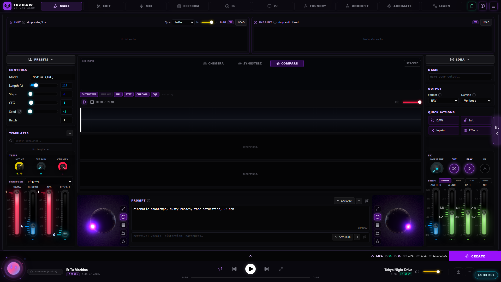
</p>

---

## Quickstart

**Double-click `theDAW.bat`. That is the entire setup.** It checks the machine, installs anything missing after one quick confirmation, and opens theDAW in the browser. The Stable Audio model downloads on its own the first time a track is generated.

```powershell
.\theDAW.bat
```

The launcher checks prerequisites, bootstraps dependencies when the tree is fresh (`uv sync --group dev`, `npm install`), clears stale processes on ports 5173/8600/5187, then runs the backend, Vite, and an optional tunnel together in one console and opens `http://localhost:5173`. Manual launch:

```bash
uv run uvicorn backend.server:app --host 0.0.0.0 --port 8600 --reload   # backend
cd frontend && npm run dev                                              # frontend
```

> The full [User Guide](docs/USER_GUIDE.md) is a deep power-user reference. It runs long and parts can lag the current app, so it works best as a reference rather than a first stop. Quick links: [Windows Setup](docs/windows/setup-guide.md), [Prompting](docs/guides/prompting.md), [§3 Installation](docs/USER_GUIDE.md#3-installation).

### Prerequisites

`theDAW.bat` installs these automatically the first time a tool is missing. The list is here for reference and for manual or non-Windows setups.

| Tool | Role |
|---|---|
| **[uv](https://docs.astral.sh/uv/getting-started/installation/)** | Python environment and package manager. Creates the venv and installs torch and CUDA. |
| **[Node.js](https://nodejs.org/) 20.19+ or 22.12+** | Frontend dev server and the VJ sidecar. Vite 7 sets the floor. |
| **[FFmpeg](https://www.gyan.dev/ffmpeg/builds/)** on PATH | Every audio path: effects, exports, library ingest, MIDI conversion, import. |
| **[Git](https://git-scm.com/)** | Clones the repo. `--recurse-submodules` brings in the Magenta sidecar source. |
| **NVIDIA driver 550+** | Runs the Medium model and Magenta. The Small model runs on CPU. |

---

## Features

Every feature has a full reference in the [User Guide](docs/USER_GUIDE.md). Names link to the section below or the relevant guide.

### Studio

- **[MAKE](#make)** generates audio from one form. [Text-to-audio](docs/USER_GUIDE.md#6-make-tab), [audio-to-audio](docs/USER_GUIDE.md#6-make-tab), [inpainting](docs/USER_GUIDE.md#6-make-tab), and [continuation](docs/USER_GUIDE.md#6-make-tab) all condition the same generation, alongside the [microphone recorder](docs/USER_GUIDE.md#6-make-tab), [Chimera fusion](docs/USER_GUIDE.md#6-make-tab), the [Spectrogram viewer](docs/USER_GUIDE.md#6-make-tab), [templates and saved prompts](docs/USER_GUIDE.md#6-make-tab), and the [async job queue](docs/USER_GUIDE.md#19-backend-api-reference).
- **[Generate](#generate)** adds cloud and real-time engines: [Suno](docs/USER_GUIDE.md#26-cloud-generation-suno) in simple, custom, cover, and mashup modes, and [Magenta RealTime 2](docs/USER_GUIDE.md#27-magenta-realtime-2) text-to-music with MIDI-note and audio-style conditioning.
- **[EDIT](#edit)** is the multi-track timeline: [per-clip waveforms](docs/USER_GUIDE.md#7-edit-tab), [move and cut](docs/USER_GUIDE.md#7-edit-tab), a [snap grid](docs/USER_GUIDE.md#7-edit-tab), a [live per-track mixer](docs/USER_GUIDE.md#7-edit-tab), [trim and fade handles](docs/USER_GUIDE.md#7-edit-tab), [inpaint from editor](docs/USER_GUIDE.md#7-edit-tab), and [commit to one stereo WAV](docs/USER_GUIDE.md#7-edit-tab).
- **[MIX](#mix)** is the effects and mastering stage: a [25-effect FFmpeg chain](docs/USER_GUIDE.md#8-mix-tab), [Quick Master macros](docs/USER_GUIDE.md#8-mix-tab), [process history](docs/USER_GUIDE.md#8-mix-tab), the six-family [Edit Tool Stack](docs/USER_GUIDE.md#28-edit-tool-stack), in-chain [VST3 hosting](docs/USER_GUIDE.md#8-mix-tab), and [.gan web-plugins](docs/USER_GUIDE.md#8-mix-tab) such as the **The Owl** spatializer.
- **[Foundry](#foundry)** designs and exports custom VST and plugin interfaces on an infinite canvas, producing the `.gan` web-plugins that host in the MIX chain.
- **[Audimate](#audimate)** chains generation into node pipelines: library sources, generate and Magenta nodes, effect, merge, and feedback stages, and outputs that save back to the library.
- **[Underfit](#underfit)** fits [LoRA adapters](docs/USER_GUIDE.md#22-lora-adapter-types): eight [adapter types](docs/USER_GUIDE.md#22-lora-adapter-types), [layer filtering](docs/workflows/lora.md), [interval gating](docs/workflows/lora.md), [SVD bases](docs/workflows/lora.md), and [autoencoder round-trips](docs/workflows/autoencoder.md).
- **[LEARN](#learn)** renders the [genealogy graph](docs/USER_GUIDE.md#12-learn-tab) in [3D and 2D](docs/USER_GUIDE.md#12-learn-tab) with a [layered SVG DAG](docs/USER_GUIDE.md#12-learn-tab) and [lineage edges](docs/USER_GUIDE.md#12-learn-tab) for every remix, inpaint, stem split, Chimera blend, and Suno cover.

### Live rig

- **[Perform](#perform)** imports a project and plays its scene and clip grid live, driving the arrangement from a launch surface.
- **[DJ](#dj)** runs two decks with [beatmatch sync and key-lock](docs/USER_GUIDE.md#9-dj-tab), [EQ, filter, and trim](docs/USER_GUIDE.md#9-dj-tab), [hotcues, loops, slip, and quantize](docs/USER_GUIDE.md#9-dj-tab), a [per-deck FX rack and master limiter](docs/USER_GUIDE.md#9-dj-tab), [live stems](docs/USER_GUIDE.md#9-dj-tab), [cue output](docs/USER_GUIDE.md#9-dj-tab), [Automix and a sampler bank](docs/USER_GUIDE.md#9-dj-tab), [MIDI-learn](docs/USER_GUIDE.md#9-dj-tab), [URL import](docs/USER_GUIDE.md#30-youtube-import), and [Design Mode](docs/USER_GUIDE.md#9-dj-tab).
- **[VJ](#vj)** drives the [VJ-9000](https://github.com/gantasmo/VJ-9000) visual engine: a [3D reactive terrain](docs/USER_GUIDE.md#10-vj-tab), [camera sources](docs/USER_GUIDE.md#10-vj-tab) including phones and Quest headsets, a [GLSL shader source](https://github.com/gantasmo/VJ-9000) with fractals, materials, and audio-mapped params, an [ASCII effect](https://github.com/gantasmo/VJ-9000), [cymatics](docs/USER_GUIDE.md#10-vj-tab) and depth-cloud sources, [source banks](https://github.com/gantasmo/VJ-9000), a [GPU effect chain](docs/USER_GUIDE.md#10-vj-tab), [Autopilot and BPM sync](docs/USER_GUIDE.md#10-vj-tab), [recording and transcode](docs/USER_GUIDE.md#10-vj-tab), and a [watch-link broadcast](docs/guides/dj-and-genealogy.md).
- **[Controllers and XR](#controllers-and-xr)** bind hardware and headsets: a [~110-profile library with auto-detect](docs/USER_GUIDE.md#31-controller-vision), [learn-by-capture](docs/USER_GUIDE.md#31-controller-vision), [Controller Vision](docs/USER_GUIDE.md#31-controller-vision), native **Audima Sway** expressive-motion support, and the [theDAW-XR](docs/USER_GUIDE.md#34-quest-and-xr-integrations) circuit of hand-tracked MIDI, passthrough streaming, co-located multiplayer, and the MIDI Reactor.

### Library, notation, and tools

- **[Library and Catalogue](#library-and-catalogue)**: a [disk-backed library](docs/USER_GUIDE.md#13-library) with [search, sort, and favorites](docs/USER_GUIDE.md#13-library), [inline playback](docs/USER_GUIDE.md#13-library), [play counts](docs/USER_GUIDE.md#13-library), the [SUGGEST playlist](docs/USER_GUIDE.md#13-library), and the cross-provider [Catalogue gallery](docs/USER_GUIDE.md#29-catalogue) with a lineage panel.
- **[Projects, plugins, and interchange](docs/USER_GUIDE.md)**: save and load whole sessions as **.tasmo** project files (ZIP + MsgPack with optional audio embedding), **import DAW projects** (Ableton `.als`, Reaper `.rpp`, FL Studio `.flp`, Audacity, Audition, Bitwig, Resolume, plus Logic / Cubase / Pro Tools export hints), host **VST3** plugins in the MIX chain via [pedalboard](https://github.com/spotify/pedalboard), and package web UIs as portable **.gan** plugins (GANTASMO's pseudo-VST format), the format that ships **The Owl** spatializer front-end.
- **[Notation and Score](#notation-and-score)**: [MAKE SHEET to MusicXML](docs/USER_GUIDE.md#33-notation-score-tabs-and-arrangements), [guitar and bass tabs](docs/USER_GUIDE.md#33-notation-score-tabs-and-arrangements), [arrangements](docs/USER_GUIDE.md#33-notation-score-tabs-and-arrangements), [ABC, PDF, and SVG export](docs/USER_GUIDE.md#33-notation-score-tabs-and-arrangements), and [prompt inference](docs/USER_GUIDE.md#33-notation-score-tabs-and-arrangements).
- **[Bottom panel](#bottom-panel)**: the [spectral analyzer](docs/USER_GUIDE.md#16-bottom-panel-tabs), [piano roll](docs/USER_GUIDE.md#15-piano-roll), [step sequencer](docs/USER_GUIDE.md#14-step-sequencer), [media bucket](docs/USER_GUIDE.md#16-bottom-panel-tabs), the [SLIDE control surface](docs/USER_GUIDE.md#16-bottom-panel-tabs), and Details.
- **[Footer, log, and assistant](#footer-log-and-assistant)**: the [player footer](docs/USER_GUIDE.md#17-player-footer), the [processing log](docs/USER_GUIDE.md#18-processing-log), and the [multi-provider assistant](docs/USER_GUIDE.md#32-admin-module-and-assistant-key-apis) with RAG over these docs.
- **[Settings and Models](#models)**: [model readiness](docs/USER_GUIDE.md#21-models), [native checkpoint registration](docs/USER_GUIDE.md#21-models), a [storage map](docs/USER_GUIDE.md#21-models), and [module enable and disable](docs/USER_GUIDE.md#32-admin-module-and-assistant-key-apis).

---

## Install paths

Four routes install and run theDAW. Pick one.

- **Windows script install.** Double-click `theDAW.bat`. It preflights prerequisites, runs `install/setup.ps1` for consent-based tool installation, then launches the backend and UI. See [docs/windows/setup-guide.md](docs/windows/setup-guide.md).
- **Release packages.** Every [GitHub Release](https://github.com/gantasmo/theDAW/releases) ships a Windows installer (`theDAW-Setup-<version>.exe`), a macOS disk image (`theDAW-<version>.dmg`), and a container image at `ghcr.io/gantasmo/thedaw`. The installers carry the Electron desktop shell, which wraps the backend and UI in one window and starts them together. See [docs/guides/electron-desktop-app.md](docs/guides/electron-desktop-app.md).
- **Pinokio launcher.** The Pinokio script installs dependencies and starts theDAW from the Pinokio browser. See [docs/guides/pinokio-launcher.md](docs/guides/pinokio-launcher.md) and [github.com/gantasmo/theDAW-Pinokio](https://github.com/gantasmo/theDAW-Pinokio).
- **Source checkout.** `git clone --recurse-submodules`, then the manual launch commands under [Quickstart](#quickstart) on any OS.

---

## Workspaces

### MAKE

<p align="center">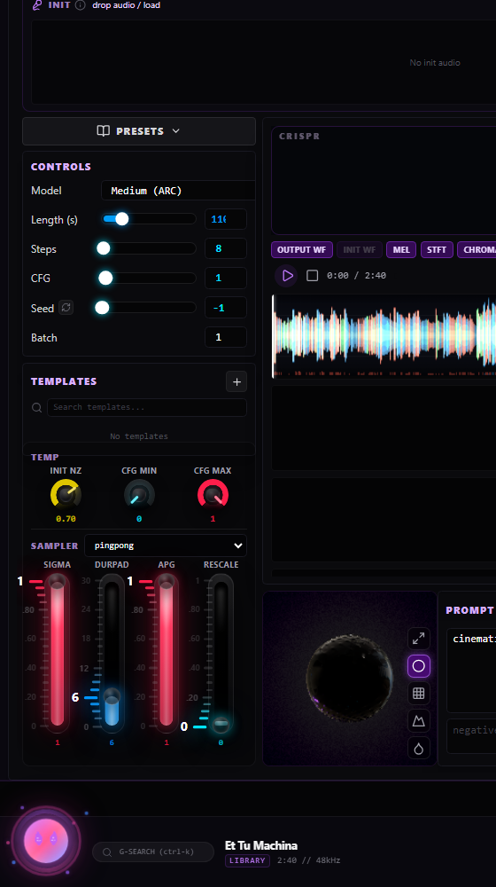</p>

One form drives text-to-audio, audio-to-audio, inpainting, and continuation. Supplied init audio, a text prompt, a painted inpaint region, and a Chimera stack all condition the same generation, and the init noise level sets how far the result departs from the source. Chimera blends several clips into one generation and beat-aligns them under Start, Downbeat, or Phrase Weave alignment. Templates store full parameter sets, Saved Prompts keep a history, and the async job queue saves every render to the library. Full reference: [User Guide §6](docs/USER_GUIDE.md#6-make-tab).

### Generate

<p align="center">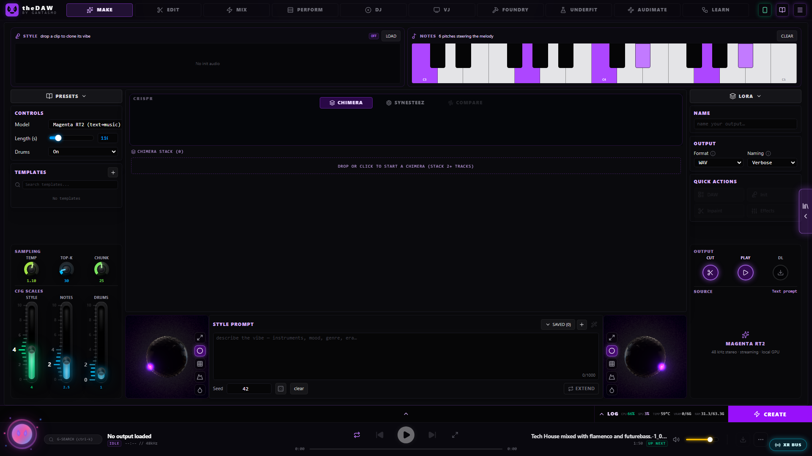</p>

Suno cloud generation runs in the Aurora Cloud Console across simple, custom, cover, and mashup modes, and cover and mashup results write lineage edges. Magenta RealTime 2 provides text-to-music whenever its sidecar is running, through the first non-Mac MRT2 port vendored at [magenta-rt2-nvidia](https://github.com/gantasmo/magenta-rt2-nvidia). The extended sidecar also accepts MIDI-note and audio-style conditioning. Full reference: [User Guide §26](docs/USER_GUIDE.md#26-cloud-generation-suno) and [§27](docs/USER_GUIDE.md#27-magenta-realtime-2).

### EDIT

<p align="center">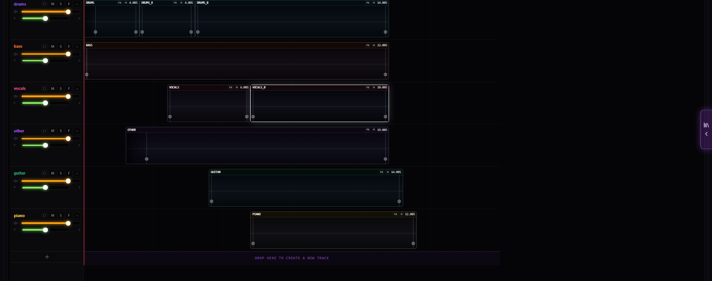</p>

The timeline holds many tracks, each clip caches its own waveform peaks, Move drags clips along and between tracks, and Cut splits a clip while preserving source alignment. Each track carries name, mute, solo, volume, and pan, and the live mixer applies them during playback. Commit Edit renders the audible tracks into one 44.1 kHz stereo WAV through `OfflineAudioContext`. Full reference: [User Guide §7](docs/USER_GUIDE.md#7-edit-tab).

### MIX

<p align="center">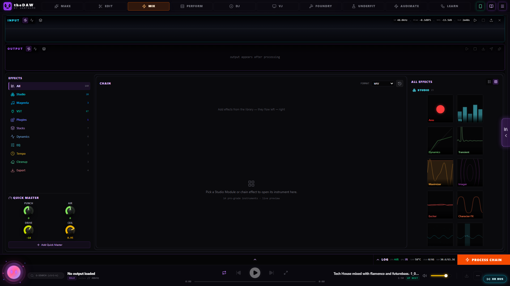</p>

A chain of 25 FFmpeg effects covers mastering, compression, filters, vocal processing, lo-fi, stereo widening, reverb, delay, LUFS normalization, pitch shift, and export to FLAC, MP3, AAC, and Opus. Four macro sliders map onto the active effect, and process history keeps the last eight runs. The Edit Tool Stack adds six module families under `/api/edit/*`, whose GUIs iframe into the effect stage. VST3 plugins, scanned from the standard folders and hosted through [pedalboard](https://github.com/spotify/pedalboard), drop into the same chain, and `.gan` web-plugins (including **The Owl**, the front-end for the HRTF spatializer) render in the effect-stage footprint and drive the live rack. Full reference: [User Guide §8](docs/USER_GUIDE.md#8-mix-tab) and [§28](docs/USER_GUIDE.md#28-edit-tool-stack).

<p align="center">
  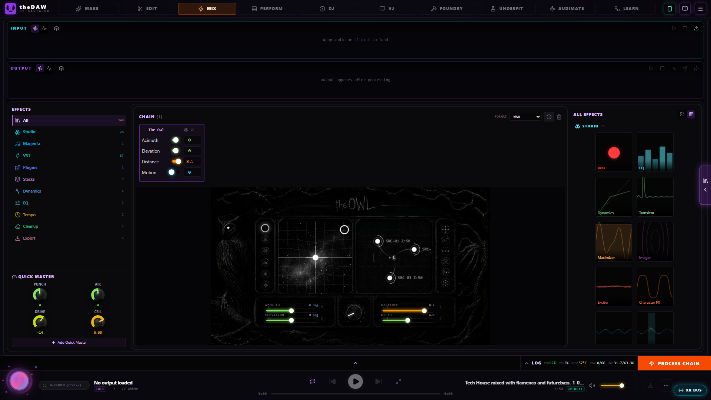
  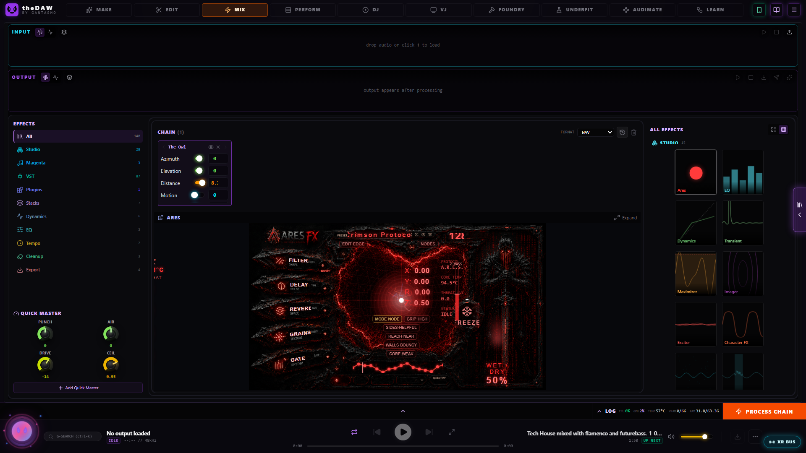
</p>

<sub align="center">The Owl and Ares are `.gan` web-plugins that render in the MIX effect stage. Each is a background image with controls placed on top, so the surface letterboxes to the artwork's native aspect ratio and never stretches.</sub>

### Perform

The Perform tab imports a project and plays its scenes and clips from a live launch grid. Scenes fire columns of clips together, individual clips trigger on their own, and the grid drives the arrangement while a set runs.

### DJ

<p align="center"></p>

Two decks run from a pro layout with jog wheels, a central mixer, and a track browser. The engine handles octave-aware beatmatch sync, key-lock, a 3-band EQ, a single-knob filter, four hotcues, beat loops and rolls, slip mode, and quantize. The FX rack adds a flanger, an impulse-response reverb, and a resonant wah per deck, with a master limiter on the bus. Live stems ride on per-stem faders, cue output pre-listens through a headphone device chosen with `setSinkId`, and Automix sequences and crossfades a set on its own. Full reference: [User Guide §9](docs/USER_GUIDE.md#9-dj-tab).

### VJ

<p align="center"></p>

The VJ tab embeds the [VJ-9000](https://github.com/gantasmo/VJ-9000) engine, which renders a glowing reactive terrain plus a unified set of live sources: cameras (webcam, phone, tablet, or Quest over the LAN), a GLSL shader source with fractals, eight materials, and audio-mapped params, an ASCII effect, cymatics, depth-cloud and spectra sources, and source banks for snapshot and recall. A composable GPU effect chain, Autopilot, BPM sync, and full MIDI mapping sit on top, and the take records to WebM and transcodes through the backend. Full reference: [User Guide §10](docs/USER_GUIDE.md#10-vj-tab).

### Foundry

<p align="center">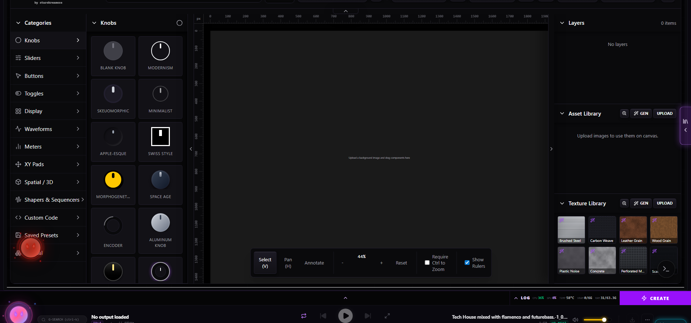</p>

The Foundry tab lays out **custom VST and plugin interfaces** on an infinite canvas. A finished design exports as a `.gan` web-plugin (GANTASMO's portable plugin format), which then hosts in the MIX chain alongside VST3 plugins and the built-in effects.

### Underfit

<p align="center">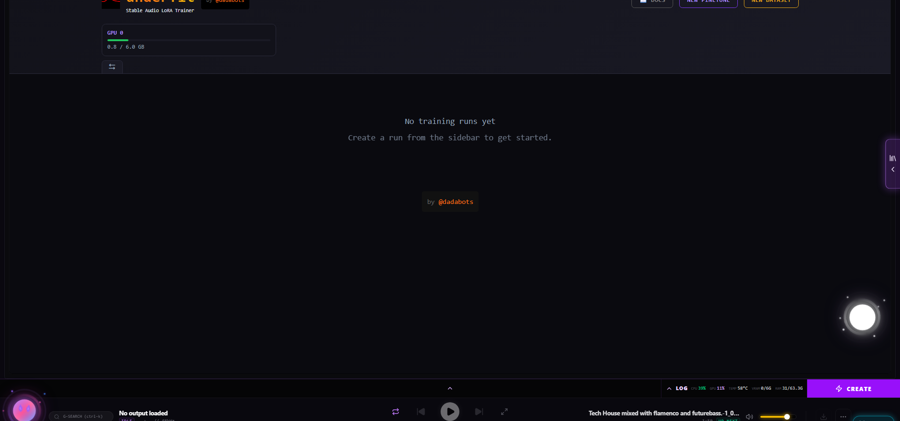</p>

Underfit fits LoRA adapters. Eight adapter types are available (`lora`, `dora-rows`, `dora-cols`, `bora`, and their `-xs` variants). Layer filtering runs through `--include` and `--exclude` with bracket-range expansion. Inference exposes runtime strength, per-LoRA interval gating within a sigma range, and a per-LoRA layer filter, and adapters stack additively. Full reference: [User Guide §22](docs/USER_GUIDE.md#22-lora-adapter-types).

### Audimate

<p align="center">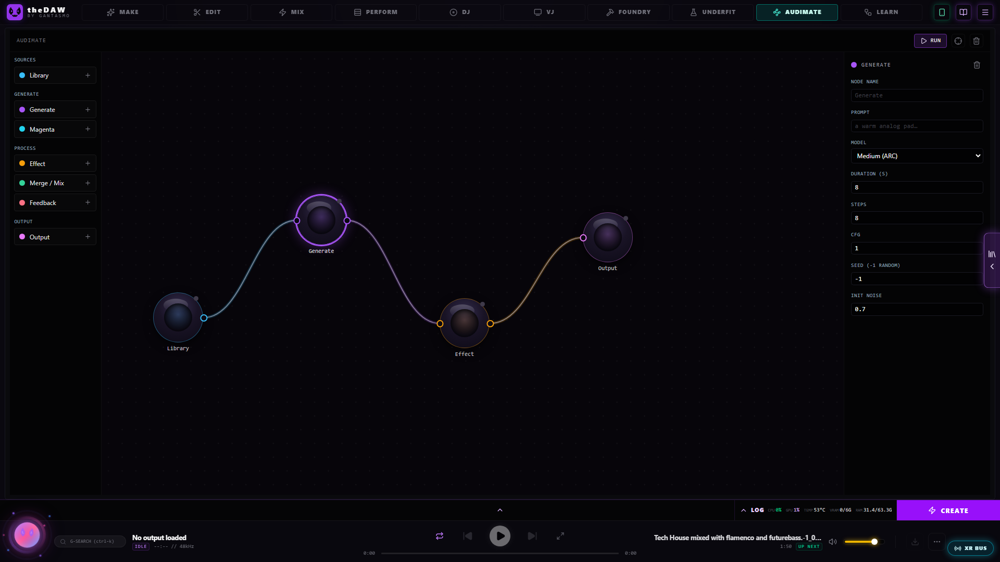</p>

Audimate is a **node-graph editor** for building generation pipelines. Nodes for library sources, generation (Stable Audio or Magenta), effect, merge, and feedback stages, and outputs wire together with bezier edges on a pannable, zoomable canvas. The inspector edits each node's parameters (prompt, model, duration, steps, CFG, seed), and Run drives the graph through the same generate, effect, and library actions the rest of the app uses, saving results back to the library.

### LEARN

<p align="center">
  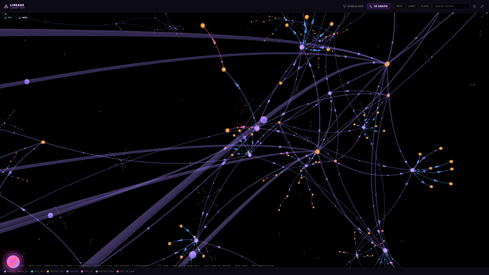
  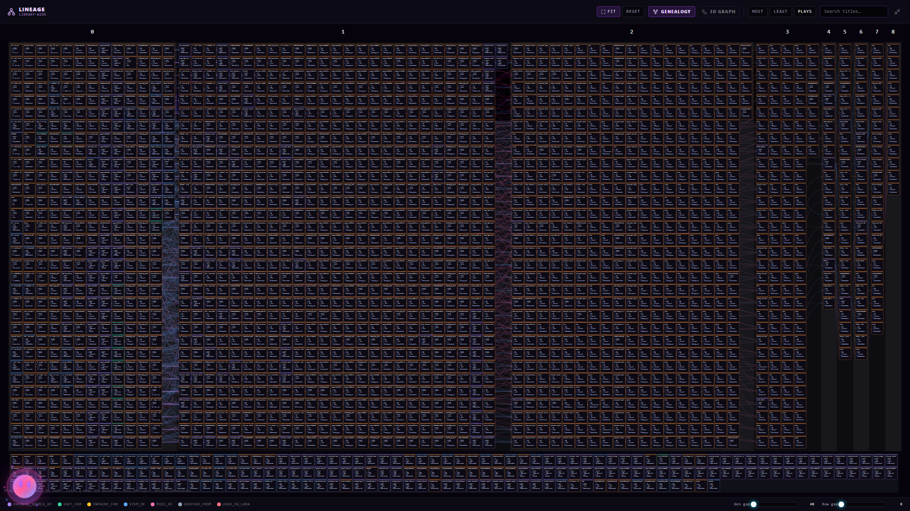
</p>

Every track and the relationships between them render as an interactive force-directed graph in 3D and 2D through `react-force-graph` and three.js, alongside a layered SVG DAG. Edges trace how a piece descended from its sources, so a remix, an inpaint, a stem split, a Chimera blend, and a Suno cover each show their parentage. Full reference: [User Guide §12](docs/USER_GUIDE.md#12-learn-tab).

### Controllers and XR

Controller recognition identifies hardware across three tiers: a library of roughly 110 device profiles, a scored auto-detect, and a learn-by-capture mode that binds a control the moment it moves. Controller Vision identifies a controller from a photo through OpenCV and a vision model. The Audima Sway is supported natively: auto-detect recognizes it, its six expressive-motion dimensions arrive as named signals for MAKE, the MIX rack, and the VJ engine, and its control-surface mode mirrors play, volume, pan, and pads onto the EDIT timeline. The [theDAW-XR](https://github.com/gantasmo/theDAW-XR) companion turns a Meta Quest 3 into a hands-only surface: **hand-tracked MIDI** from floating faders and knobs, passthrough video into VJ, co-located multiplayer, and a head-mounted MIDI Reactor, all over ADB. Full reference: [User Guide §31](docs/USER_GUIDE.md#31-controller-vision) and [§34](docs/USER_GUIDE.md#34-quest-and-xr-integrations).

### Library and Catalogue

<p align="center">
  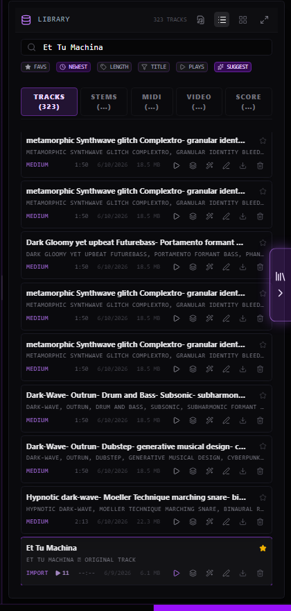
  
</p>

The library lives on the backend, with audio on disk, metadata in `data/library.db`, and access over `/api/library/*`. Every render saves automatically with its prompt, model, duration, steps, CFG, seed, and timestamp. **SUGGEST** builds a continuous playlist ordered by Camelot-wheel harmony and a chosen BPM flow, then plays it through the footer queue or sends it to the DJ tab. The Catalogue view adds a cross-provider gallery with provider badges, an inspector with **on-demand spectrograms**, and a lineage panel. Full reference: [User Guide §13](docs/USER_GUIDE.md#13-library) and [§29](docs/USER_GUIDE.md#29-catalogue).

### Notation and Score

<p align="center"></p>

The Score tab turns a track's **MIDI into symbolic music**. MAKE SHEET converts the first MIDI to MusicXML with music21 and renders it through OpenSheetMusicDisplay. The Tabs section arranges guitar or bass tablature for a chosen tuning, capo, and difficulty through a dynamic-programming pass and renders with alphaTab. Arrange builds lead-sheet, piano-reduction, simplified, or band-score MusicXML, scores export to ABC, PDF, and SVG, and PROMPT INFERENCE derives a Stable Audio prompt from a track's analysis. Full reference: [User Guide §33](docs/USER_GUIDE.md#33-notation-score-tabs-and-arrangements).

### Bottom panel

<p align="center">
  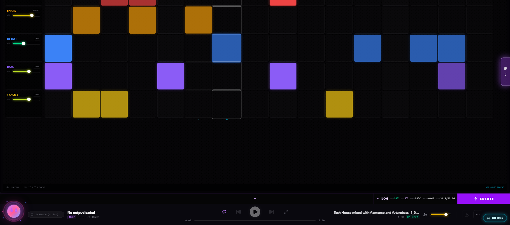
  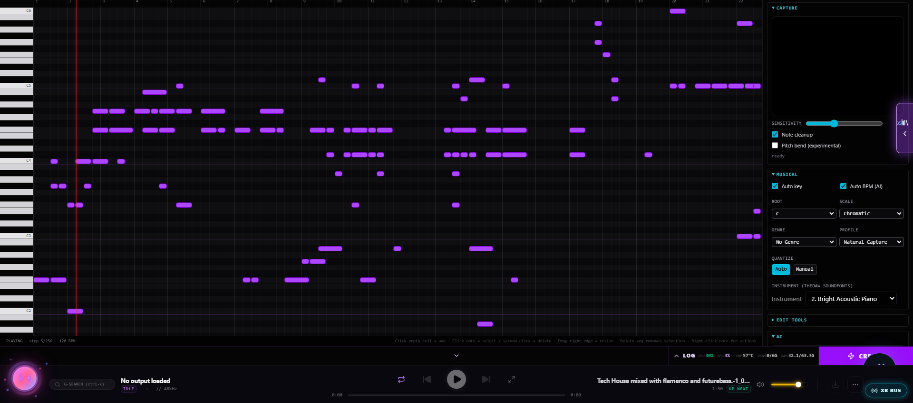
  <br>
  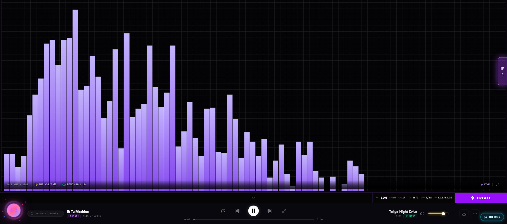
  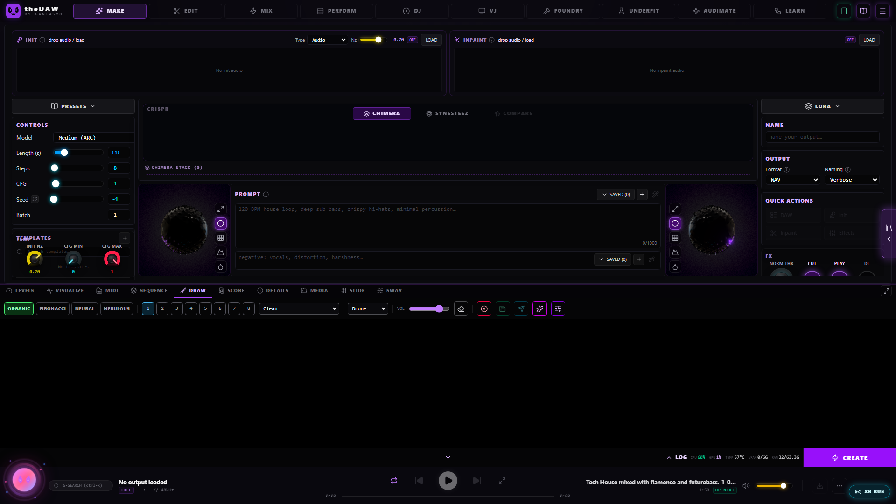
</p>

The spectral analyzer shows oscilloscope, spectrum, and radial modes with RMS and peak meters. The piano roll edits MIDI-style notes, imports and exports MIDI, and renders to the editor. The step sequencer runs a 16-step drum machine with five synthesized voices. The DRAW tab turns drawn gestures into generative music across Organic, Fibonacci, Neural, and Nebulous modes and records the result to the library or EDIT. The media bucket holds session audio, SLIDE presents a glass surface of faders and knobs synced with the VJ engine, and Details and Score show the selected entry. Full reference: [User Guide §14](docs/USER_GUIDE.md#14-step-sequencer) through [§16](docs/USER_GUIDE.md#16-bottom-panel-tabs).

### Footer, log, and assistant

The footer stays across every tab with the current title, a status chip, transport, a seek bar, a volume slider, and a download button. The processing log is a 500-entry ring buffer with leveled, color-coded lines and SIMPLE / VERBOSE view modes. The assistant orb streams chat from any configured provider, including Claude Code over the CLI, Gemini, Anthropic, OpenAI, Grok, Groq, OpenRouter, Ollama, LM Studio, llama.cpp, and vLLM, with a hashed multi-key pool, attachments, and RAG over the docs through ChromaDB. Full reference: [User Guide §17](docs/USER_GUIDE.md#17-player-footer), [§18](docs/USER_GUIDE.md#18-processing-log), and [§32](docs/USER_GUIDE.md#32-admin-module-and-assistant-key-apis).

---

## Ecosystem

theDAW is the hub of a small constellation of repositories, each with its own README and badges.

| Project | Repo | Role |
|---|---|---|
| **VJ-9000** | [](https://github.com/gantasmo/VJ-9000) | The WebGL audio-reactive visual engine embedded in the VJ tab and runnable standalone. |
| **magenta-rt2-nvidia** | [](https://github.com/gantasmo/magenta-rt2-nvidia) | The first non-Mac port of Magenta RealTime 2, vendored at `sidecars/magenta-rt2-nvidia`. |
| **theDAW-XR** | [](https://github.com/gantasmo/theDAW-XR) | The Meta Quest 3 spatial companion: hand-tracked MIDI, passthrough streaming, and colocation. |

In-tree sidecars under `sidecars/` (`questcast`, `queststitch`, `magenta`) and the backend modules under `backend/modules/` bridge these into theDAW over `/api/*`.

---

## Structure

| Component | Location | Description |
|---|---|---|
| **Upstream ML pipeline** | `stable_audio_3/` | DiT diffusion transformer, SAME autoencoder, all samplers, LoRA training and inference, distribution-shift schedules. |
| **FastAPI backend** | `backend/server.py` | Async HTTP wrapper running a generation job queue, FFmpeg audio processing, and model introspection on port 8600. |
| **Backend modules** | `backend/modules/` | Plugin system. Each subdirectory provides `module.json` and `router.py`, and the loader mounts every enabled module and isolates failures. The repo ships 42 modules, including `analysis`, `analyzer`, `chimera`, `controllervision`, `convert`, `effects`, `library`, `midi`, `notation`, `settings`, `stems`, `storage`, `vj`, and `ytimport`, the cloud and real-time engines (`suno`, `magenta`), the XR bridges (`questmidi`, `questcast`, `queststitch`, `xrcontrol`, `quest`), the `foundry` plugin designer, the `underfit` LoRA trainer, the `akvj` depth pipeline, `broadcast` for watch-link, `modeldl`, and the Edit Tool Stack under `/api/edit/*`. |
| **theDAW interface** | `frontend/` | React 19, Vite 7, Tailwind 4, Zustand 5. Ten workspaces (MAKE, EDIT, MIX, Perform, DJ, VJ, Foundry, Underfit, Audimate, Learn) plus the library, the Catalogue, and the live tools. The dev server on port 5173 proxies `/api/*` to the backend. |
| **Sidecars** | `sidecars/` | The vendored `magenta-rt2-nvidia` port, the `questcast` and `queststitch` Quest bridges, and the `magenta` studio sidecar. |

### Folder map

The table above maps the components; the tree below is the same root as it looks on a first run, with the folders a new user actually touches called out.

```
stable-audio-3/
|-- theDAW.bat        <-- double-click this to install everything and launch (backend :8600, UI :5173)
|-- backend/          <-- FastAPI server and the plugin modules behind /api/*
|-- frontend/         <-- the React / Vite workspace served at http://localhost:5173
|-- stable_audio_3/   <-- the Stable Audio 3 inference library (DiT, SAME autoencoder, LoRA)
|-- sidecars/
|   |-- magenta-rt2-nvidia/   <-- run Setup-MRT2.bat in here once to install the Magenta RT2 engine
|   |-- magenta/              <-- the Magenta studio sidecar
|   \-- questcast/            <-- the Quest video bridge
|-- electron-ui/      <-- the optional desktop (Electron) shell, chosen in Settings > Startup
|-- install/          <-- setup.ps1, the consent-based installer theDAW.bat runs when a tool is missing
|-- docs/             <-- the User Guide, setup guides, and workflow docs
|-- data/             <-- created at runtime; the personal library (gitignored, safe to back up)
|   |-- generations/            <-- every render and import, plus the library.db metadata
|   |-- plugins/                <-- installed .gan web-plugins
|   |-- settings.json           <-- app settings
|   \-- local_checkpoints.json  <-- checkpoints registered in Settings > Models
|-- models/           <-- OPTIONAL: create this folder and drop checkpoint subfolders here (see below)
|-- local_models.txt  <-- OPTIONAL: extra checkpoint folders to search, one path per line
|-- tests/            <-- the pytest suite for the inference library
|-- scripts/          <-- automation that captures the screenshots and the feature tour
\-- .venv/            <-- created by uv sync; the Python environment (no need to touch it)
```

**Where do models go?**

- **The built-in models need no manual placement.** Every load resolves local-first: local model folders, then the Hugging Face cache at `%USERPROFILE%\.cache\huggingface\hub\` (relocatable by setting `HF_HOME` before launch), then a one-time download into that cache. **Local only (never download)** is on by default for fresh installs, so nothing fetches until it is allowed in **Settings → Models**; once allowed, the weights download automatically on the first generation that needs them (the `medium` checkpoint is roughly 17 GB), and the T5Gemma text encoder fetches into the same cache.
- **A checkpoint already on disk** registers through the **Add** control in **Settings → Models**: browse to the folder (or the `.safetensors` file itself) and it appears in the MAKE model picker. Entries persist in `data/local_checkpoints.json`, and removing one never touches the files.
- **The folder convention** works without the UI: create `models/` at the repo root (or list extra directories in `local_models.txt`, one path per line, or in the `SA3_LOCAL_MODELS_DIR` environment variable, `;`-separated on Windows) and give each checkpoint a subfolder named after its Hugging Face repo, for example `models/stable-audio-3-medium/` holding the config JSON and the `.safetensors`. [User Guide §21.2](docs/USER_GUIDE.md#212-manual-model-placement-download-links-and-folder-tree) has the full download table.
- **Magenta RealTime 2 models are not placed by hand.** `sidecars/magenta-rt2-nvidia/Setup-MRT2.bat` installs the WSL2 engine and its assets in one pass.

---

## Architecture

theDAW is a React frontend over a FastAPI backend that wraps the Stable Audio 3 pipeline, a plugin module system, and spawned sidecars. The frontend proxies `/api/*` to the backend on port 8600. Heavy features (the AI assistant, the MIDI tab, and the in-app docs) are code-split and load on first use rather than at boot, and the startup cinematic ships its logo, environment map, and model at display resolution, so the workspace paints quickly. The wiki [Dataflow](https://github.com/gantasmo/theDAW/wiki/Dataflow) page maps every input and output in one chart.

**System.**

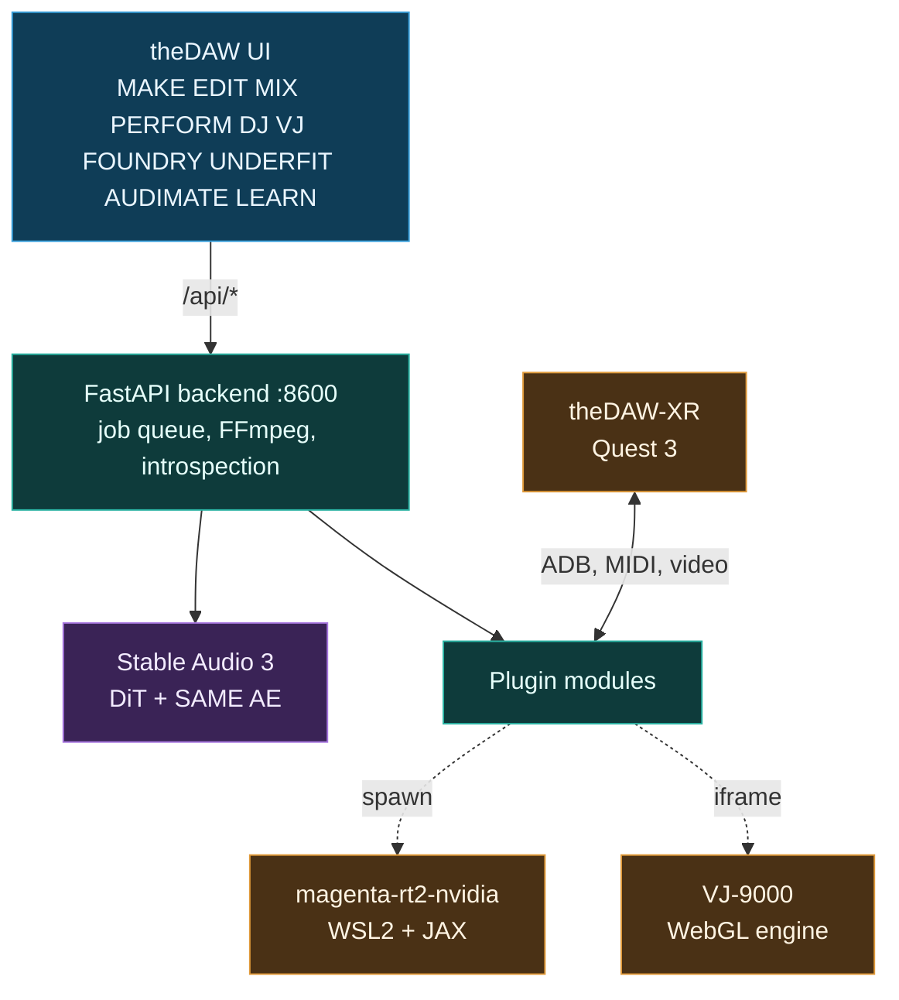
```mermaid
flowchart TD
  UI["theDAW UI<br/>MAKE EDIT MIX PERFORM DJ VJ FOUNDRY UNDERFIT AUDIMATE LEARN"]:::in
  API["FastAPI backend :8600<br/>job queue, FFmpeg, introspection"]:::proc
  SA3["Stable Audio 3<br/>DiT + SAME AE"]:::eng
  MODS["Plugin modules"]:::proc
  MRT2["magenta-rt2-nvidia<br/>WSL2 + JAX"]:::side
  VJ["VJ-9000<br/>WebGL engine"]:::side
  XR["theDAW-XR<br/>Quest 3"]:::side
  UI -->|/api/*| API
  API --> SA3
  API --> MODS
  MODS -. spawn .-> MRT2
  MODS -. iframe .-> VJ
  XR <-->|ADB, MIDI, video| MODS
  classDef in fill:#0f3d57,stroke:#3aa0db,color:#eaf6ff;
  classDef eng fill:#3a2356,stroke:#a877e0,color:#f3ecff;
  classDef proc fill:#0e3b3b,stroke:#2bb3a3,color:#e6fffb;
  classDef side fill:#4a3115,stroke:#e09a3a,color:#fff4e3;
```

**Generation.** Several inputs condition one generation; the DiT renders latents, the autoencoder decodes them, every render saves to the library, and LEARN draws the lineage.

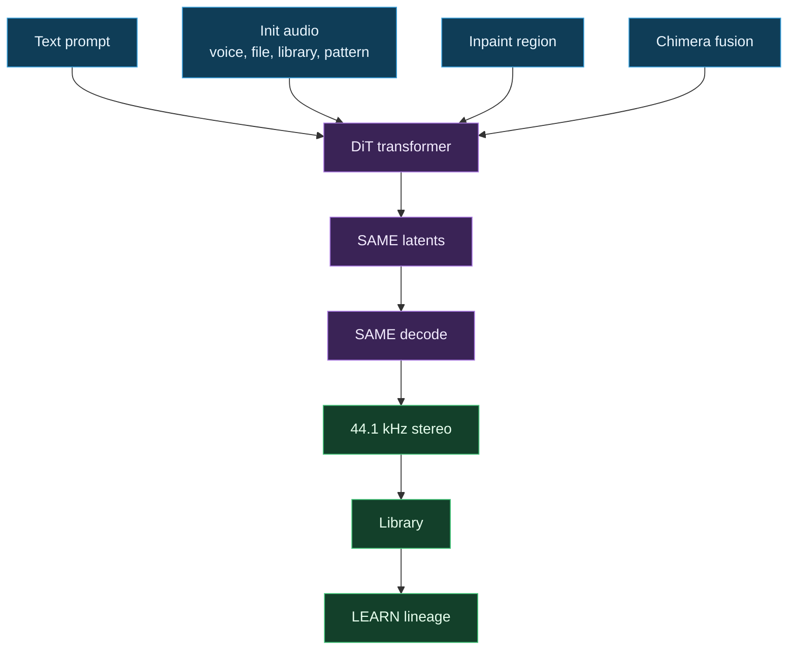
```mermaid
flowchart TD
  P["Text prompt"]:::in
  INIT["Init audio<br/>voice, file, library, pattern"]:::in
  MASK["Inpaint region"]:::in
  CHI["Chimera fusion"]:::in
  P --> GEN
  INIT --> GEN
  MASK --> GEN
  CHI --> GEN
  GEN["DiT transformer"]:::eng --> LAT["SAME latents"]:::eng
  LAT --> DEC["SAME decode"]:::eng
  DEC --> WAV["44.1 kHz stereo"]:::out
  WAV --> LIB["Library"]:::out
  LIB --> LRN["LEARN lineage"]:::out
  classDef in fill:#0f3d57,stroke:#3aa0db,color:#eaf6ff;
  classDef eng fill:#3a2356,stroke:#a877e0,color:#f3ecff;
  classDef out fill:#13402a,stroke:#46c47a,color:#e7ffee;
```

**Routing.** Player audio, a microphone, MIDI, and SLIDE drive the VJ engine and the DJ console, and theDAW-XR feeds hand-tracked MIDI and passthrough video into the same buses.

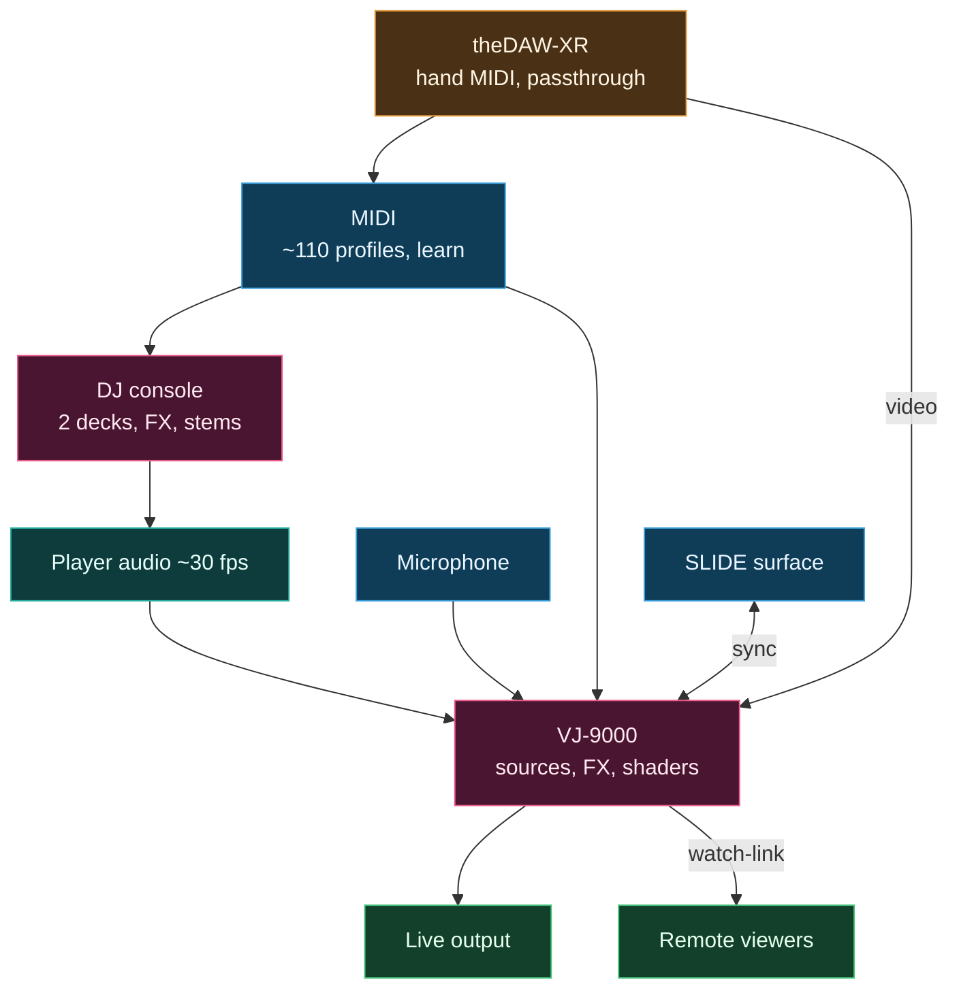
```mermaid
flowchart TD
  DJ["DJ console<br/>2 decks, FX, stems"]:::live
  MIC["Microphone"]:::in
  MIDI["MIDI<br/>~110 profiles, learn"]:::in
  SLIDE["SLIDE surface"]:::in
  XR["theDAW-XR<br/>hand MIDI, passthrough"]:::side
  DJ --> AUD["Player audio ~30 fps"]:::proc
  AUD --> VJ
  MIC --> VJ
  MIDI --> VJ
  MIDI --> DJ
  SLIDE <-->|sync| VJ
  XR --> MIDI
  XR -->|video| VJ
  VJ["VJ-9000<br/>sources, FX, shaders"]:::live --> OUT["Live output"]:::out
  VJ -->|watch-link| WEB["Remote viewers"]:::out
  classDef in fill:#0f3d57,stroke:#3aa0db,color:#eaf6ff;
  classDef proc fill:#0e3b3b,stroke:#2bb3a3,color:#e6fffb;
  classDef live fill:#4a1530,stroke:#e85a8a,color:#ffe9f1;
  classDef out fill:#13402a,stroke:#46c47a,color:#e7ffee;
  classDef side fill:#4a3115,stroke:#e09a3a,color:#fff4e3;
```

---

## Models

| Key | Flavor | Params | Autoencoder | Hardware | Max Duration |
|---|---|---|---|---|---|
| `small` | ARC | 433 M | SAME-S | CPU | 120 s |
| `medium` | ARC | 1.4 B | SAME-L | GPU (CUDA) | 380 s |
| `small-rf` / `medium-rf` | RF | 433 M / 1.4 B | SAME-S / SAME-L | CPU / GPU | 120 / 380 s |
| `same-s` / `same-l` | Autoencoder | 266 M / 1.7 B | n/a | CPU / GPU | n/a |

ARC checkpoints are post-trained for 8-step inference at `cfg_scale=1`. RF checkpoints are rectified-flow bases for LoRA training at `cfg_scale=7` and roughly 50 steps. This table lists the primary keys; the specialized release checkpoints (`small-music`, `small-sfx`, and the `medium-base` / `music-base` / `sfx-base` variants) and their exact folders are catalogued in [User Guide §21.2](docs/USER_GUIDE.md#212-manual-model-placement-download-links-and-folder-tree). Nothing downloads at startup; a model loads on the first generation that needs it, and the in-app **Settings, then Models** panel can register checkpoints already on disk.

---

## Python API

```python
from stable_audio_3 import StableAudioModel
pipe = StableAudioModel.from_pretrained("medium")

# Text-to-audio
audio = pipe.generate(prompt="Lo-fi boom bap meets orchestral strings, 84 BPM", duration=180)

# Audio-to-audio. init_noise_level sets how far the result departs from the source.
audio = pipe.generate(init_audio=torchaudio.load("in.wav"), init_noise_level=0.9,
                      prompt="bossa nova bassline", duration=30)

# LoRA stacks additively; runtime strength is adjustable.
pipe.load_lora("style.safetensors")
pipe.set_lora_strength(0.8)
audio = pipe.generate(
    prompt="...", duration=30,
    sampler_type="dpmpp",          # euler | rk4 | dpmpp | pingpong
    apg_scale=1.0,                 # Adaptive Projected Guidance
    cfg_interval=(0.0, 1.0),       # apply CFG only within this sigma range
)
```

[docs/workflows/lora.md](docs/workflows/lora.md) covers adapter types and layer filters, and [docs/workflows/autoencoder.md](docs/workflows/autoencoder.md) covers the standalone autoencoder.

---

## Layout and themes

The interface restyles and rearranges without touching a config file.

**Change theme.** The hamburger menu opens the Change Theme modal: sixteen themes spanning dark, metallic, paper, pastel, and color families, plus a custom mode that builds a theme from any background image. A theme recolors every surface in the app through shared design tokens, from the EDIT timeline to the DJ console. Obsidian is the default.

<p align="center">
  
  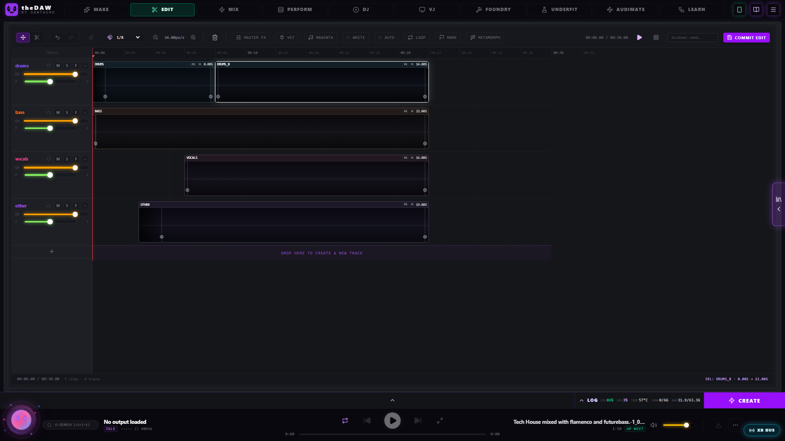
  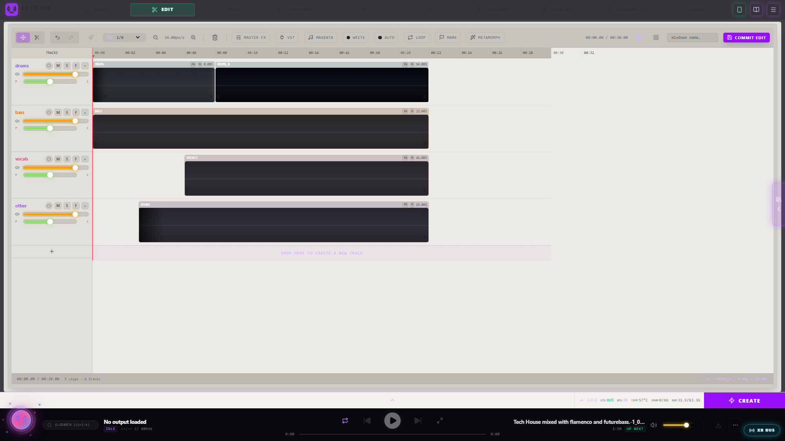
  
  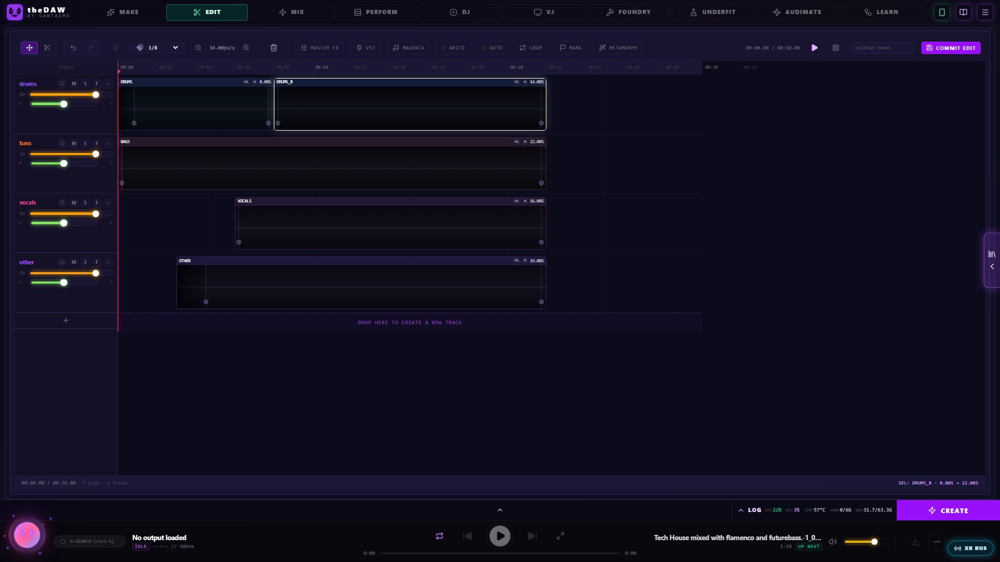
  
</p>

<sub align="center">Obsidian and Graphite from the dark family, Porcelain and Paper from the paper family, Aurora and Sunset from the color family.</sub>

**Edit layout.** The workspace itself adjusts per session: the library panel collapses, the right panel resizes, the bottom panel swaps between its tabs (analyzer, piano roll, sequencer, bucket, SLIDE, Details, Score), the LEARN graph toggles fullscreen, and the DJ tab's Design Mode rearranges the console.

---

## Documentation

| Document | Contents |
|---|---|
| [docs/USER_GUIDE.md](docs/USER_GUIDE.md) | The complete manual covering every feature, control, and endpoint, rendered in-app by the Docs button. |
| [docs/guides/prompting.md](docs/guides/prompting.md) | Prompt structure, conditioning signals, and style reference. |
| [docs/guides/SUNO_EXTERNAL_API.md](docs/guides/SUNO_EXTERNAL_API.md) | Suno cloud-generation API reference covering modes, polling, and usage. |
| [docs/guides/model-overview.md](docs/guides/model-overview.md) | Architecture design and model comparison. |
| [docs/guides/notation-and-score.md](docs/guides/notation-and-score.md) | Audio to MIDI, sheet music, tabs, arrangements, and prompt inference. |
| [docs/guides/dj-and-genealogy.md](docs/guides/dj-and-genealogy.md) | DJ console, the genealogy graph, and the watch-link broadcast. |
| [docs/workflows/inference.md](docs/workflows/inference.md), [lora.md](docs/workflows/lora.md), [autoencoder.md](docs/workflows/autoencoder.md) | Inference modes, LoRA adapters and training, and the standalone autoencoder. |
| [docs/windows/setup-guide.md](docs/windows/setup-guide.md), [troubleshooting.md](docs/windows/troubleshooting.md) | Windows installation (CUDA, Flash Attention, soundfile) and fixes. |

The GitHub **[Wiki](https://github.com/gantasmo/theDAW/wiki)** mirrors this index in a browsable form across theDAW and its sidecars.

---

## Automation

theDAW generates its own documentation and promo material from the live app. `scripts/screenshots/` drives a real session to capture feature screenshots and a coverage report, and `frontend/_capture_clips.mjs` is a Playwright harness that records the running app into the feature-tour video. The in-app assistant answers from these same documents through a ChromaDB RAG index, so the docs, the video, and the assistant stay sourced from one place.

---

## Troubleshooting

**Static glitch output on the Medium model.** Flash Attention is not installed correctly. Verify it with `uv run python -c "from flash_attn import flash_attn_func; import flash_attn; print(flash_attn.__version__)"` and reinstall a wheel matching the Python, torch, and CUDA combination from [kingbri1/flash-attention](https://github.com/kingbri1/flash-attention/releases).

**"API UNREACHABLE" banner.** The backend is not listening on port 8600. Test it with `curl http://localhost:8600/api/health`. On Windows, `.\theDAW.bat` clears stale processes automatically.

**Out-of-memory on the Medium model.** The `small` model, a shorter `duration`, or freeing competing CUDA processes resolves it.

[User Guide §23](docs/USER_GUIDE.md#23-troubleshooting) has the full matrix.

---

## Credits

theDAW was built by **[GANTASMO](https://github.com/gantasmo)** as part of the [Music Hackspace](https://musichackspace.org) Music Technology Hackathon at [Berklee College of Music](https://www.berklee.edu).

## Built With

- **[Stability AI](https://stability.ai)** provides Stable Audio 3 and [stable-audio-tools](https://github.com/Stability-AI/stable-audio-tools), the diffusion model and pipeline at the core of theDAW.
- **[Magenta](https://github.com/magenta)** RealTime by **[Google DeepMind](https://deepmind.google)** brings real-time music generation, running through theDAW's own [NVIDIA/CUDA port](https://github.com/gantasmo/magenta-rt2-nvidia), the first and only non-Mac port so far.
- **[Suno](https://suno.com)** powers cloud music generation.
- **[T5Gemma](https://huggingface.co/google/t5gemma-b-b-ul2)** by Google handles text conditioning.
- **[Demucs](https://github.com/facebookresearch/demucs)** by Meta AI handles stem separation, and **[basic-pitch](https://github.com/spotify/basic-pitch)** by Spotify handles audio-to-MIDI transcription.
- **[music21](https://github.com/cuthbertLab/music21)** by MIT builds MusicXML, ABC, tabs, and arrangements, **[alphaTab](https://www.alphatab.net)** and **[OpenSheetMusicDisplay](https://opensheetmusicdisplay.org)** render tablature and scores in the browser, and **[MuseScore](https://musescore.org)** engraves PDF and SVG.
- **[MLX](https://github.com/ml-explore/mlx)** by Apple is the inference core the Magenta port builds on, extended here with a CUDA backend.
- **[PyTorch](https://pytorch.org)**, **[FFmpeg](https://ffmpeg.org)**, **[three.js](https://threejs.org)**, **[react-force-graph](https://github.com/vasturiano/react-force-graph)**, **[WaveSurfer.js](https://wavesurfer.xyz)**, **[React](https://react.dev)**, **[Vite](https://vitejs.dev)**, and **[Tailwind CSS](https://tailwindcss.com)** carry the rest, alongside the wider open-source community.

Corrections and additions to this list are welcome through a GitHub issue.

## Special Thanks

To [Music Hackspace](https://musichackspace.org) and [Berklee College of Music](https://www.berklee.edu) for hosting the hackathon, and to Zack, CJ, Jordi, Zach, and Matt from [Stability AI](https://stability.ai) for their continued help and support.

---

<p align="center">
  <a href="https://open.spotify.com/artist/4q5n0QgK6mvyuw8FRzhuNA"></a>
  <a href="https://www.youtube.com/@GANTASMO"></a>
  <a href="https://www.instagram.com/gantasmo"></a>
  <a href="https://x.com/gantasmo"></a>
  <a href="https://gantasmo.com"></a>
</p>

<p align="center"><sub>Made by <a href="https://github.com/danieljtrujillo">Daniel Joaquin Trujillo</a> and <a href="https://github.com/StarskreamEXE">Josh Valenzuela</a> as GANTASMO.</sub></p>
